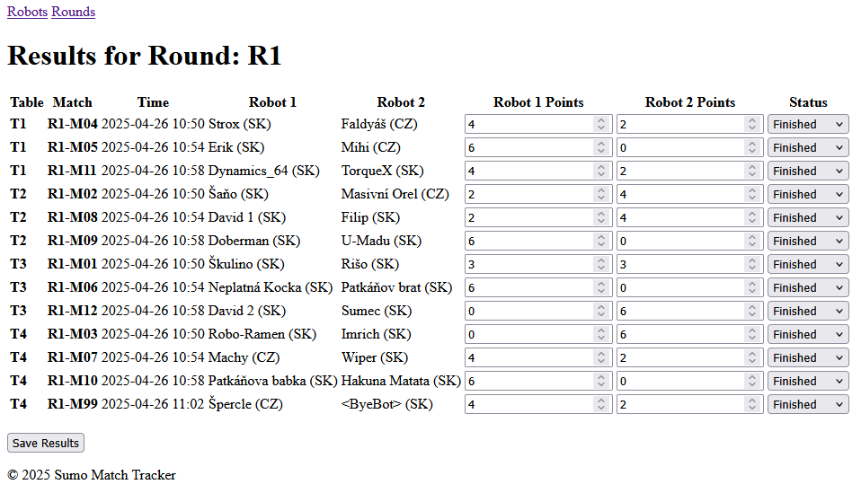

# smtracker
Sumo Match Tracker - A Django-based web application for managing Lego sumo robot competitions, 
including registration, match scheduling in Swiss tournament style, and results tracking - developed with guidance from ChatGPT.

Run the server:
`python manage.py runserver 0.0.0.0:8000`

http://127.0.0.1:8000/smtracker/

http://127.0.0.1:8000/admin/

